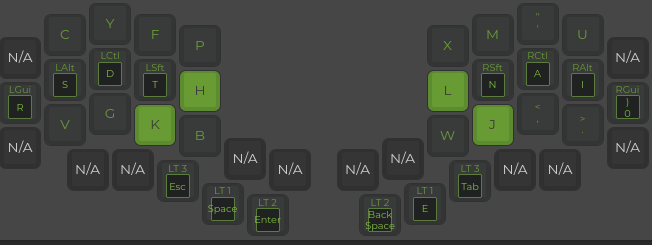
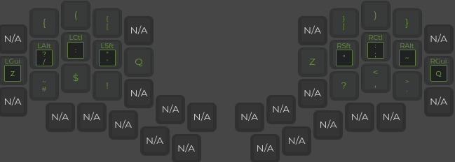
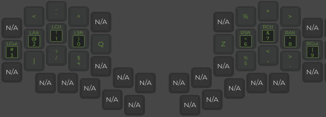
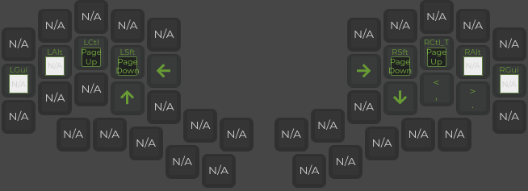

# KEYMAP
## EDITING THE KEYMAP
Upload the ```kyria_keymap.json``` file to ```https://config.qmk.fm```
You can redownload after making edits

## INSTALLATION

1) clone the repo
2) plug in one side of the keyboard
3) run ```qmk flash kyria_keymap.json -bl avrdudeqmk flash kyria_keymap.json -bl avrdudeqmk flash kyria_keymap.json -bl avrdude```
4) repeat step 3 with the other side of the keyboard plugged in

## LAYERS
### BASE Layer



### SYMBOL LAYER (layer 2)



### NUMBER LAYER (layer 1)



### NAVIGATION LAYER (layer 3)


