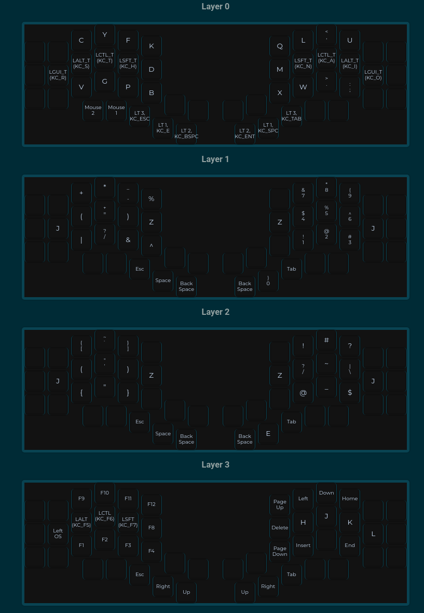

# KEYMAP

## EDITING THE KEYMAP
Upload the ```kyria_keymap.json``` file to ```https://config.qmk.fm```

You can redownload after making edits

## INSTALLATION

1) clone the repo
2) plug in one side of the keyboard
3) run ```qmk flash kyria_keymap.json -bl avrdude```
4) repeat step 3 with the other side of the keyboard plugged in

## MOUSE BUTTON SUPPORT

- go to qmk firmware root directory
- edit the ```keyboards/splitkb/kyria/rules.mk``` file
- change the ```MOUSEKEY_ENABLE``` value to yes
